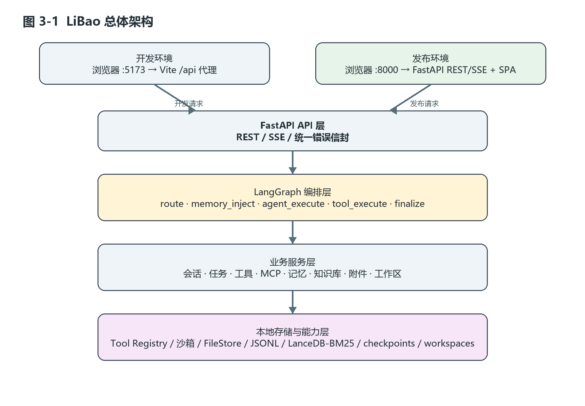
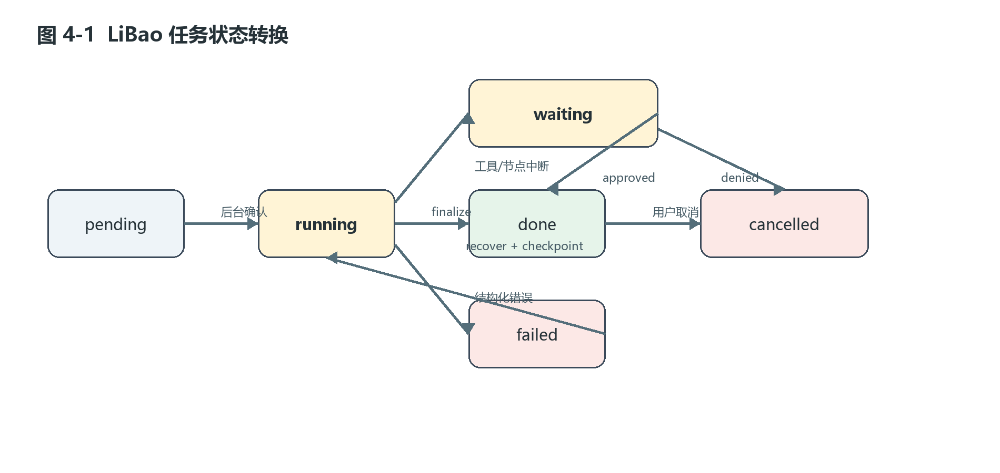
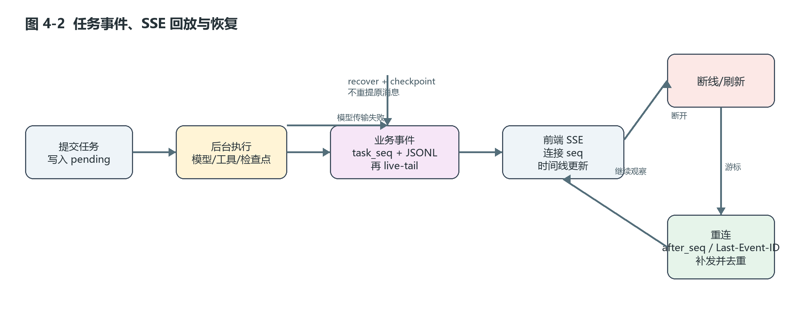

# LiBao：本地优先通用 Agent Runtime 与 Web 工作台的设计与实现

## 本科毕业设计（论文）初稿

论文题目：LiBao：本地优先通用 Agent Runtime 与 Web 工作台的设计与实现  
副标题：——面向大语言模型智能体的工程化运行时研究  
学生姓名：________________  
学号：________________  
院系：________________  
专业：________________  
指导教师：________________  
日期：20____年____月____日

> 初稿说明：本文以 LiBao 当前工作树、项目文档、测试和已有开题报告为事实来源。标记为“[待补]”的内容不能直接作为最终定稿结论，须由作者补充运行记录、截图或学校要求的实验数据。

## 摘要

随着大语言模型应用从单轮问答扩展到多轮对话、工具调用、文件处理和长期记忆，应用系统面临的问题已经不只是如何生成文本，还包括任务如何启动和结束、工具失败如何处理、流式结果如何观察、连接中断后如何恢复，以及本地数据和外部能力如何被限制在明确边界内。许多面向 Agent 的示例能够展示模型调用链路，却没有同时解决任务状态、事件回放、检查点恢复、工具治理和跨平台交付等工程问题。

本文设计并实现了 LiBao，一个面向个人用户的本地优先通用 Agent Runtime 与 Web 工作台。系统以 FastAPI 和 LangGraph 为后端基础，以 Vue 3、TypeScript、Pinia 和 Vite 构建 Web 前端，并将对话、任务、工具、MCP 源、记忆、知识库、工作区和发布脚本纳入同一运行时边界。本文的主要工作包括：设计由状态图驱动的任务编排流程；使用持久化业务事件、单调游标和检查点实现流式任务的观察、回放、取消与恢复；以统一的 ToolSpec、授权谓词和执行器治理内置工具、自定义工具与 MCP 工具；通过工作区路径校验、事件安全投影和本地回环部署约束数据与能力边界；通过 Windows/Linux 持续集成、OpenAPI 契约快照和发布包冒烟测试验证交付质量。

在 2026 年 9 月 17 日本轮工作树上，后端完整测试为 779 项通过、4 项跳过，前端单元测试为 313 项通过；针对本文核心链路的聚焦回归测试为 86 项通过、2 项跳过。项目已有的一次历史验收记录还包含后端 775 项通过、前端 Mock E2E 72 项通过、根目录测试 45 项通过和 Windows 发布包冒烟通过。本文不将这些结果外推为性能或模型质量结论，真实模型端到端指标、故障恢复比例、资源开销和人工可用性数据仍需补充。研究表明，对于本地 Agent 系统，将模型调用、工具执行、状态持久化、前端事件流和发布边界作为一个可验证整体设计，比单纯增加 Prompt 或功能页面更能支撑长期运行和问题追踪。

**关键词：** 大语言模型智能体；Agent Runtime；任务编排；MCP；SSE；检查点恢复；本地优先；跨平台交付

## Abstract

As large language model applications evolve from single-turn question answering to multi-turn conversations, tool use, file operations and long-term memory, the central engineering problems are no longer limited to text generation. An Agent application must also define how tasks are started and terminated, how tool failures are handled, how streaming results are observed, how interrupted executions are resumed, and how local data and external capabilities are constrained. Existing Agent demos often show a model-call loop, but do not address task state, event replay, checkpoint recovery, tool governance and cross-platform delivery as one system.

This thesis designs and implements LiBao, a local-first general-purpose Agent Runtime and Web workbench for individual users. The backend is based on FastAPI and LangGraph, while the Web frontend is built with Vue 3, TypeScript, Pinia and Vite. Conversations, tasks, tools, MCP sources, memories, knowledge bases, workspaces and release scripts are managed within one runtime boundary. The main contributions are: a state-graph-based task orchestration flow; persistent business events, monotonic cursors and checkpoints for observing, replaying, cancelling and recovering streaming tasks; a unified ToolSpec, authorization predicate and executor for built-in, custom and MCP tools; workspace path validation, event projection and loopback deployment for data and capability boundaries; and a cross-platform validation process based on Windows/Linux CI, an OpenAPI contract snapshot and release-package smoke tests.

On September 17, 2026, the current working tree passed 779 backend tests with 4 skips and 313 frontend unit tests. The focused regression suite for this thesis covered task events, recovery, graph orchestration, MCP management and synchronization, workspace operations and document context, with 86 passed tests and 2 skipped tests. A previous project acceptance record also reports 775 passed backend tests, 72 passed frontend Mock E2E tests, 45 passed root-level tests and a successful Windows release smoke test. These results are not interpreted as performance or model-quality measurements. Real-model end-to-end metrics, recovery rates, resource consumption and human usability data remain to be collected. The work suggests that treating model calls, tool execution, state persistence, frontend event delivery and release boundaries as one verifiable system provides a stronger foundation for long-running local Agents than adding prompts or isolated features alone.

**Keywords:** large language model agent; Agent Runtime; task orchestration; MCP; SSE; checkpoint recovery; local-first; cross-platform delivery

## 目录

1. 绪论  
2. 相关技术与研究现状  
3. 需求分析与系统总体设计  
4. Agent Runtime 与任务编排设计  
5. 工具、MCP 与本地能力治理  
6. Web 工作台与数据持久化实现  
7. 跨平台交付与实验验证  
8. 总结与展望  
参考文献

# 第 1 章 绪论

## 1.1 研究背景

大语言模型具有较强的自然语言理解和生成能力，但单次模型调用本身并不等于一个可以长期运行的智能体系统。面对“读取一个项目、检索资料、调用工具、修改文件并给出结果”这类任务，系统必须在多轮模型决策之间保存上下文，在工具返回后重新组织消息，在结果还未完成时将中间状态展示给用户，并在网络、模型或工具发生故障时决定任务是重试、暂停、取消还是从断点继续。

Agent 研究通常将模型的思考和行动结合起来。ReAct 将推理与行动交替组织，使模型可以根据环境反馈继续决策[1]；Toolformer 研究了语言模型学习调用外部工具的方式[2]；检索增强生成把外部知识检索引入模型生成流程[3]。这些研究说明了“模型—工具—环境”循环的可能性，但当循环进入实际软件系统后，还会出现一些与模型算法并列的工程约束：任务状态是否一致，事件是否可回放，工具能力是否可以被发现和撤销，凭据是否会进入日志，工作区路径是否可能越界，以及程序能否在不同操作系统上稳定启动。

LiBao 的设计背景正是上述问题的交汇处。它不是针对某一垂直领域训练的模型，也不以公网多租户服务为目标，而是为个人用户提供一个可以在 Windows、Linux 和 macOS 本地运行的通用 Agent 工作台。系统默认绑定 `127.0.0.1`，运行数据位于用户目录下的 `~/.LiBao`，通过 Web 页面完成对话、任务观察、工具管理、知识库、记忆和工作区操作。

## 1.2 问题定义

本文将 LiBao 需要处理的工程问题归纳为四类。

第一，运行时问题。任务可能包括多轮模型调用和工具调用，需要支持流式输出、取消、确认、失败、恢复和结束；如果只把一次对话实现为一个同步函数，前端无法准确知道任务状态，服务重启后也难以恢复。

第二，能力治理问题。内置工具、自定义工具和 MCP 工具具有不同来源，但都需要统一的名称、参数模式、启用状态、授权关系、确认策略、沙箱级别和超时设置。工具在模型上下文中可见，不应自动意味着它可以被执行。

第三，本地边界问题。对话、上传文件、工作区文件、长期记忆、知识库和模型凭据具有不同的生命周期和敏感程度。系统需要避免把秘密写入 Git、前端 DOM、普通日志或可回放事件，也需要防止文件操作离开允许的工作区根目录。

第四，交付问题。开发环境可使用 Vite 和 DevPanel，发布环境却应尽量减少进程和代理依赖。Windows 与 POSIX 系统在路径、脚本、端口和进程终止方面存在差异，需要由自动化验证而不是人工印象保证一致性。

## 1.3 研究内容与主要贡献

围绕上述问题，本文完成以下研究与实现：

（1）分析本地通用 Agent 的运行需求，提出以任务状态、事件日志和检查点为核心的运行时模型，并实现 LangGraph 主状态图。

（2）设计持久化业务事件与实时订阅相结合的 SSE 机制。`task_seq` 作为跨连接游标，单次连接的 `seq` 仅服务于当前流，从而支持历史回放、断线重连和事件去重。

（3）设计统一工具注册中心。模型侧 ACI 的生成与执行侧授权使用同一个 `agent_can_use` 谓词；MCP 注册先验证服务和工具列表，再进行命名冲突检查和批量写入。

（4）设计本地单用户边界。系统使用本地文件和 JSONL 管理运行数据，使用 LanceDB/BM25 支持知识与记忆检索；工作区文件引用经过规范化、根目录约束和读取前二次校验。

（5）建立从开发到发布的跨平台验证链路。发布时由 FastAPI 同时提供 REST、SSE 和前端 SPA；CI 在 Windows/Linux 矩阵中执行后端、前端、契约、发布和安全相关检查。

## 1.4 论文组织结构

第 1 章说明研究背景、问题和贡献；第 2 章介绍 Agent、RAG、图式编排、MCP 和 SSE 等相关技术，并分析现有工作的不足；第 3 章进行需求分析和总体设计；第 4 章讨论 Agent Runtime 与任务编排；第 5 章讨论工具、MCP 和本地能力治理；第 6 章介绍 Web 工作台与数据持久化实现；第 7 章给出测试、故障注入、跨平台和发布验证方案及当前结果；第 8 章总结全文并讨论局限与未来工作。

# 第 2 章 相关技术与研究现状

## 2.1 大语言模型智能体

本文所称 Agent，是以大语言模型为决策核心，能够读取上下文、选择工具、接收环境反馈并继续执行任务的软件系统。一个最小循环可以抽象为：

```text
用户目标 → 上下文构造 → 模型决策 → 工具执行 → 结果观察 → 下一轮决策或结束
```

与普通聊天接口相比，Agent 具有两个特点。其一，模型输出不再只是最终文本，还可能是一个工具调用计划；其二，执行过程不是原子操作，而是由多个可观察步骤组成。因此，系统设计必须同时描述模型输入、工具能力、状态迁移和外部副作用。

ReAct 说明了推理与行动交替的基本模式，但实际系统不能把“思考文本”直接当作可靠状态。LiBao 将可持久化状态放在任务、消息、事件和 checkpoint 中，把模型的动态思考视为运行过程中的非稳定信息，并在事件投影时过滤敏感或过大的字段。

## 2.2 工具调用与 MCP

函数调用或工具调用通常需要向模型提供函数名称、描述和参数模式。LiBao 将这组信息称为 ACI（Agent-Computer Interface）的一部分，并由 `ToolSpec.aci()` 生成统一的函数结构。工具名称用于模型请求，稳定的工具 ID 用于注册表和 API。

MCP（Model Context Protocol）提供了模型应用与外部工具/资源服务器之间的标准化连接方式[6]。LiBao 将 MCP 源视为一种可治理的工具来源，而不是绕过本地注册中心的特殊通道：注册时先连接并取得 `list_tools` 结果，检查源内和组织范围内的名称冲突后，才写入 MCP 源和工具定义；运行时通过统一的执行器调用 MCP 管理器。

## 2.3 RAG、记忆与上下文工程

RAG 通过检索相关资料为生成模型提供外部上下文，适用于知识密集型任务[3]。长期记忆则记录跨任务可能有用的用户事实、偏好或项目信息。二者都存在“把多少内容注入模型”的问题：注入过少会降低相关性，注入过多会增加上下文长度和噪声。

LiBao 将上下文拆成相对稳定和动态的部分。系统提示词和工具 ACI 放在前部，历史消息、工作区/项目叠加、记忆索引和状态栏作为动态内容追加到后部。记忆注入节点根据最近一条用户消息进行语义检索；当用户身份缺失、查询为空或检索故障时返回空引用，不让记忆故障击穿主对话。项目级能力文件只把索引注入消息通道，具体文件由工具按需读取。

## 2.4 图式编排与检查点

图式编排把 Agent 流程表示为节点和边。LangGraph 将状态和节点执行结合，适合表示带有条件分支、循环和中断的任务[5]。LiBao 的主图为：

```text
START
  ↓
route
  ↓
memory_inject
  ↓
agent_execute ──有工具调用──> tool_execute ──未达上限──> memory_inject
  ↓无工具调用                                      │达上限
context_update <──────────────────── agent_execute（收口轮）
  ↓
finalize
  ↓
END
```

图的运行状态需要在执行之间保存，才能支持确认恢复和进程重启后的继续。检查点不是“把所有内容复制到日志”，而是以线程标识、状态和恢复游标构成可寻址的运行快照。LiBao 的任务恢复接口根据错误类型选择普通恢复或指定 checkpoint 恢复，并在模型传输失败恢复时使用 `initial=None`，避免重新执行已经提交的用户消息和工具调用。

## 2.5 SSE 与断线恢复

SSE 使用 HTTP 长连接向浏览器推送服务器事件，适合服务器向前端持续发送模型 token、工具状态和任务终态。LiBao 将事件分为实时过程事件和持久业务事件：token、thinking 等高频过程数据不强制进入持久日志；message_start、tool_call、tool_result、status、done、error、cancelled 等业务边界事件可以写入任务 JSONL。

为了避免“回放历史”和“实时订阅”之间出现竞态，服务端先建立订阅，再读取历史事件。历史事件和实时事件都带有跨连接的 `task_seq`；客户端从 `after_seq` 或 `Last-Event-ID` 得到游标，重复事件可以被丢弃。单次 SSE 连接另行生成 `seq`，避免把一个连接的编号误当作任务全局游标。

## 2.6 研究现状与 LiBao 的定位

现有研究分别从推理行动、工具学习、检索增强和多 Agent 协作等角度推进了 Agent 能力。AutoGen 等工作进一步讨论了多 Agent 对话框架[4]。工程社区中的 LangGraph、MCP 及各种 Agent 工作台则提供了图式执行和工具连接能力。然而，面向个人本地运行环境的研究和项目文档，往往不会同时展开讨论任务回放、恢复语义、凭据投影、工作区路径、跨平台进程回收和发布包边界。

LiBao 的定位不是提出新的语言模型算法，而是在这些能力之间建立工程闭环：模型作出决策，工具受统一授权执行，任务状态和事件可观察、可回放，持久化数据具有明确目录和敏感字段边界，发布方式可以在不同操作系统上重复验证。该定位决定了本文评价重点是运行时可靠性、工具治理、本地边界和交付可验证性，而不是模型在开放域问答上的准确率。

# 第 3 章 需求分析与系统总体设计

## 3.1 系统定位与边界

LiBao 是本地优先的通用 Agent Runtime 与 Web 工作台，支持 Windows、Linux 和 macOS 本地单用户运行。系统默认只绑定 `127.0.0.1`，配置和运行数据默认位于 `~/.LiBao`，固定本地用户为 `admin`。当前版本不把公网认证、租户隔离、生产级审计和多实例调度作为首发能力。

这一边界不是功能缺失的临时说法，而是安全设计的一部分。只有明确服务不面向公网多用户，才能把本地文件目录、进程内事件订阅和用户级配置作为可验证前提；如果未来改变部署目标，就必须重新设计认证、租户、审计、并发和密钥管理。

## 3.2 功能需求

系统功能需求如下。

| 编号 | 功能需求 | 说明 |
| --- | --- | --- |
| F1 | 对话与任务提交 | 用户提交自然语言输入，可附带工作区、文件和上下文 |
| F2 | 流式任务观察 | 前端展示消息、工具调用、状态、错误和最终结果 |
| F3 | 任务控制 | 支持取消、等待确认、确认恢复、失败重试和 checkpoint 恢复 |
| F4 | 工具管理 | 查看、搜索、启用/停用、测试内置和自定义工具 |
| F5 | MCP 管理 | 注册 MCP 源、验证工具发现、启用/停用和注销源 |
| F6 | 上下文能力 | 支持短期会话、长期记忆、项目记忆、知识库、附件和工作区 |
| F7 | 本地运行 | 提供 Windows/POSIX 启动、测试和发布脚本 |
| F8 | 运行诊断 | 提供健康检查、任务轨迹、错误结构和 DevPanel 本地监管 |

## 3.3 非功能需求

可靠性方面，任务状态必须能够被查询，持久事件必须可以重放，恢复不能无意重复原始用户输入；可观察性方面，事件需要包含可排序游标和 trace 信息，但不得把凭据和完整提示词写入可回放载荷；安全方面，文件操作应限制在工作区，外部工具应经过启用与授权；可移植性方面，脚本不应依赖某个固定用户目录或单一 shell；可交付性方面，发布包应只包含运行所需内容，并在干净目录中完成启动冒烟。

## 3.4 总体架构

LiBao 的总体链路为：

```text
开发环境：浏览器 :5173 → Vite /api 代理 → FastAPI :8000
发布环境：浏览器 :8000 → FastAPI REST/SSE + SPA
                         ↓
              LangGraph 状态图与任务运行器
                         ↓
           服务层 → 工具注册中心/MCP/沙箱
                         ↓
       FileStore/JSONL、LanceDB/BM25、附件、工作区
```

后端保持 API → 编排 → 服务 → 工具 → 存储/核心的依赖方向。前端按路由页面、Pinia 领域状态、API 封装、composable 和组件分层。DevPanel 只负责本地进程监管，不参与业务请求。发布时前端静态构建物被复制到后端目录，由 FastAPI 的 `SPAStaticFiles` 为非 API 深层路由回退 `index.html`。



图 3-1 展示了开发与发布两种入口如何汇聚到同一 FastAPI API 层，再进入 LangGraph 编排、业务服务、能力和本地存储层。

## 3.5 数据与目录设计

本地单机版本不依赖 SQL 数据库。运行数据目录示意如下：

```text
~/.LiBao/
├── settings.json
├── conversations.json / tasks.json / ...
├── sessions/
├── task_events/
├── checkpoints/
├── kb/
├── uploads/
├── workspaces/
└── cache/
```

不同数据的职责如下：

| 数据 | 存储 | 生命周期与用途 |
| --- | --- | --- |
| 会话、任务和基础实体 | FileStore/JSONL | 用户本地运行数据 |
| 任务业务事件 | `task_events/*.jsonl` | 回放、断线续接和终态通知 |
| LangGraph 检查点 | `checkpoints/` | 中断和恢复的状态快照 |
| 知识库与记忆向量 | LanceDB/BM25 | 语义检索和关键词回退 |
| 上传附件 | `uploads/` | 受用户和会话关联的文件 |
| 工作区文件 | `workspaces/` | 项目约定、源码、知识和记忆文件 |
| 模型和 MCP 配置 | `settings.json`/本地实体 | 只在后端使用，秘密不进入 Git/前端 |

## 3.6 API 与契约

API 基础路径为 `/api/v1`。成功响应使用 `code=0` 的统一信封，失败响应包含错误码、消息和可选 trace ID。任务流使用 SSE，事件典型顺序为：

```text
message_start → token* → tool_call/tool_result → status → done 或 error
```

`contracts/openapi.json` 是 REST 契约快照。任何后端 schema 变化都需要同步前端类型、Mock、E2E 和文档。该约束把“接口改了但前端仍按旧格式工作”的问题变成可以由 CI 发现的契约差异。

# 第 4 章 Agent Runtime 与任务编排设计

## 4.1 状态模型

LiBao 的 AgentState 包含消息、Agent 配置、已选择工具、用户标识、记忆引用、项目记忆索引、项目叠加内容、工具结果、运行标志、token/成本统计、运行日志、最终消息、待发布事件和占位任务等字段。状态模型同时服务于主图节点和运行日志，避免每个节点自行维护一套隐式上下文。

任务实体则关注生命周期和外部可观察性。任务状态可抽象为：

```text
pending → running → done
                    ↘ failed
                    ↘ cancelled
running → waiting_confirm → running 或 cancelled
failed  → running（满足 recover 前置条件）
```

提交阶段先写入 `pending`，后台运行器再次读取任务并确认其仍为 pending 后才转换为 running。这样可以处理“提交完成但运行器尚未启动时用户已经取消”的竞态。状态迁移前重新读取任务，避免旧对象把已经取消的任务覆盖回 running 或 done。

## 4.2 主状态图

主图实现为 `build_graph()`。`route` 负责初始路由，`memory_inject` 在模型调用前加入长期记忆，`agent_execute` 调用模型，`tool_execute` 执行工具，`context_update` 更新上下文，`finalize` 负责收束结果。

`agent_execute` 之后，如果最后一条消息包含工具调用且步数没有超过 `max_steps`，进入工具执行；否则进入上下文更新。工具执行之后，如果达到最大步数，则进入收口轮，让模型直接形成文本回答，避免最终结果裸返回工具 JSON；未达到上限则回到记忆注入节点，确保下一轮模型调用仍能获得最新记忆。

这种设计有两个作用。第一，把模型决策、工具执行和结果收束拆成可测试节点；第二，把死循环控制写成显式的状态条件，而不是寄希望于模型自行停止。收口轮的工具调用被丢弃，`finalize` 还会在没有合适文本时提供兜底结果，并记录 `max_steps_exceeded` 标志。



图 4-1 展示了任务从提交、运行到终态，以及确认和 checkpoint 恢复分支的关系。

## 4.3 上下文构建

上下文构建器遵循“三段式”原则：

1. 静态 system prompt 放在消息列表最前面；
2. 工具 ACI 通过模型接口绑定，不把完整函数定义反复写入消息正文；
3. 历史消息、工作区叠加、长期记忆、项目知识索引和状态栏等动态内容追加到尾部。

在工具数量不超过配置阈值时，系统按稳定 ID 排序注入全部 ACI；工具过多时启用渐进式披露，常驻 `tool_search` 等元工具，只把最近搜索选择的工具加入当前上下文。ACI 注入和实际执行都通过 `agent_can_use` 校验，防止模型看到了一个工具但执行路径绕过授权，或工具未对模型可见却被后台错误执行。

## 4.4 记忆和项目上下文

记忆注入节点先从最近的用户消息提取检索查询，再调用记忆仓储进行语义检索。每条记忆在注入前被投影为 ID、标题、类型、截断文本和重要度，避免把存储对象直接暴露给模型。当用户 ID 缺失、向量服务异常或查询为空时，节点返回空的 `memory_refs`，主任务继续执行。

工作区的 `.agent/` 目录保存项目约定、项目级 skills、项目记忆和项目知识。上下文只注入这些文件的索引或约定，正文通过受控文件工具按需读取。该策略兼顾了项目上下文的可用性和上下文长度，也让来源文件可以被用户检查和修改。

## 4.5 流式执行与事件模型

任务执行由后台运行器负责。运行器建立图配置、解析对话线程、准备附件和文档上下文，然后消费图事件。图内实时事件可直接推送给当前 SSE 客户端；任务级业务事件则经 `push_event` 进入任务事件服务。

事件服务维护安全事件类型集合，并对载荷执行投影：工具结果去掉完整输入和输出；中断载荷去掉工具输入；消息事件去掉 thinking、工具输入和工具输出；通用清理逻辑过滤 `api_key`、`authorization`、`prompt`、`messages`、`image_payload`、`data_b64` 和 `base64` 等键，同时截断过长字符串。



图 4-2 展示了持久业务事件、当前连接 SSE、断线后的游标回放以及 checkpoint 恢复之间的关系。

事件发布过程在任务级锁内递增 `last_event_seq`，写入 `task_events/<task_id>.jsonl`，再投递到进程内订阅队列。终态事件 `done`、`error` 和 `cancelled` 会关闭订阅队列。SSE 端点遵循“先订阅，再读历史”的顺序，并按游标过滤重复记录。

## 4.6 取消、确认与恢复

对于需要用户确认的工具或节点，运行器把中断信息写入任务的 `pending_confirm`，状态转换为 `waiting_confirm`，并发送 `interrupt` 业务事件。前端可以显示确认信息，用户选择批准或拒绝。批准通过 LangGraph `Command(resume=...)` 继续原线程；拒绝将任务置为 cancelled。

对于模型传输失败，系统区分“可重试”和“可恢复”。恢复接口先做任务归属、状态、幂等键和恢复次数检查，再根据请求的 Accept 头选择 SSE 续流或后台恢复。后台恢复从 checkpoint 继续，传入 `initial=None`，从而避免再次添加原用户消息。若是进程重启场景，系统要求存在记录的恢复 checkpoint ID，否则不执行盲目恢复。

上述机制的关键不是把所有错误都自动重试，而是让错误具有结构化的 `kind`、`retryable`、`recoverable` 和 `details` 字段，使用户和前端能够作出不同处理。

# 第 5 章 工具、MCP 与本地能力治理

## 5.1 统一工具模型

LiBao 使用 `ToolSpec` 描述工具：

| 字段 | 作用 |
| --- | --- |
| `id` | 运行时稳定标识，内置工具或 MCP 工具均有唯一 ID |
| `name` | 模型函数调用使用的名称 |
| `description`、`params_schema` | 生成 ACI 和参数校验 |
| `enabled` | 运行时启用状态 |
| `require_confirm` | 是否在产生副作用前请求用户确认 |
| `sandbox`、`allowlist` | 文件/命令能力的执行边界 |
| `idempotent`、`timeout_ms`、`max_retries` | 重试与资源控制依据 |
| `tool_type`、`effect` | 能力分类和副作用分类 |
| `mcp_source` | MCP 工具的来源关联 |

注册中心同时维护 ID 索引和 name 反向索引。注册时检查 ID 和名称冲突；工具注销时同时移除两个索引。这样可以避免同名工具遮蔽真实实现，也方便根据模型返回的函数名快速找到工具 spec。

## 5.2 启用态与授权不变量

工具定义在本地存储中是元数据事实源，运行时注册中心是可执行实现宿主。工具创建、更新、启用/停用和启动同步都通过桥接逻辑更新注册中心。新工具在领域服务层默认启用，但底层 `ToolSpec` 的默认值仍是关闭，避免直接构造运行时对象时意外暴露能力。

LiBao 把 ACI 绑定与执行守卫统一为一个谓词：

```text
agent_can_use(spec, tool_ids)
  = spec 存在
    且 spec.id 属于 agent 的启用集
    且 spec.enabled 为真
```

这是一条重要不变量：出现在模型工具集合中的工具应当能够通过执行授权；未启用的工具即使名称可被猜到，也不应被 executor 执行。论文中的“统一治理”主要指该不变量和其周边的元数据同步，不意味着已经形成多租户级别的安全隔离。

## 5.3 MCP 两阶段注册

MCP 服务注册过程分为两阶段。第一阶段根据 URL 或命令解析传输类型，建立临时连接并调用 `list_tools`；连接失败直接返回结构化错误。第二阶段先收集全部工具名称，执行源内 slug 冲突、运行时注册表冲突和组织范围内数据库冲突检查；只有全量检查通过后，才创建 MCP 源行、工具定义行和运行时 spec。

该流程避免了“注册一半后在中途失败”的半注册状态。工具保存时保留原始 MCP 工具名，运行时 spec 使用稳定的 slug ID，调用时将原始名称传递给 MCP 服务器。MCP 源注销时软删除源和关联工具，同时摘除注册表中的 spec，保证同一进程内重新注册不会被旧 spec 错误阻挡。

## 5.4 MCP 连接复用与熔断

MCP 管理器以服务源为单位创建 owner-task。调用请求进入队列，由 owner-task 串行执行连接操作并将结果返回给等待 future；连接建立和关闭均绑定到 owner-task 生命周期，减少跨请求复用异步资源时的上下文问题。

每个 MCP 源维护一个简单熔断状态机。连续失败达到阈值后进入 OPEN，冷却期间直接拒绝；冷却结束后允许一次 HALF_OPEN 探测，成功则恢复 CLOSED，失败则重新进入冷却。熔断结果以失败返回给工具执行器，而不是静默地把 MCP 工具当成成功工具，从而保留失败原因。

## 5.5 文件、工作区与沙箱

工作区文件路径统一使用相对 POSIX 分隔符。读取前执行路径解析与根目录约束，引用实际读取时再次进行 realpath 检查；在支持的平台上使用 `O_NOFOLLOW` 防止最终路径跟随符号链接。Windows 没有完全等价的通用标志，因此依赖同步二次校验和显式符号链接处理。

工作区创建时在本地 workspaces root 下派生可读且唯一的目录名，并初始化 `.agent/` 骨架。文件列表、读取、写入、重命名和删除都通过工作区归属校验后执行。硬删除工作区时，先清理关联会话、消息轨迹、记忆版本、附件和 checkpoint，再提交数据删除，最后 best-effort 清理磁盘目录和附件文件。

命令工具另有沙箱级别和命令构造器。论文只将这些能力描述为“边界机制”，不把规则沙箱等同于经过第三方认证的安全沙箱；对于公网部署、恶意租户和强对抗场景，仍需额外的系统级隔离。

# 第 6 章 Web 工作台与数据持久化实现

## 6.1 前端分层

前端入口为 `index.html`、`src/main.ts`、`App.vue` 和路由。`src/api` 封装 REST、SSE、任务控制和接口可用性；`src/stores` 使用 Pinia 管理领域状态；`src/composables` 管理流式聊天、任务轮询和响应式状态；`src/components` 提供布局、业务、工作区和轨迹组件；`src/mock` 提供单测和 Mock E2E 使用的确定性 API。

开发环境中，浏览器访问 Vite 端口，前端通过相对路径 `/api` 访问后端；DevPanel 负责启动真实后端、Vite 和展示日志。Mock 只用于单元测试和 Mock E2E，不作为真实后端运行模式的替代。发布环境中，FastAPI 挂载构建后的前端目录，浏览器直接访问后端端口。

## 6.2 对话与任务时间线

对话页面将用户消息、模型消息、工具调用、工具结果、状态、错误和恢复按钮统一放在任务时间线中。SSE composable 在组件销毁时中止连接，并维护连接阶段；当任务进入可恢复错误时，页面提供重新连接、从断点继续、重试失败消息或恢复草稿等分支。

前端的重连依据任务事件的 `last_event_seq` 或服务端传回的事件 ID，而不是简单从头请求。服务端只回放持久业务事件，实时 token 只在当前连接内传递；因此刷新后能够恢复任务状态和工具边界，但不保证历史补回每一个 token 字符。这种取舍减少了持久化压力，也让回放语义落在可重建的业务事件上。

## 6.3 工具与 MCP 页面

工具页面展示名称、描述、来源、类型和启用状态，支持关键词搜索、单个启停、批量启停和工具测试。批量操作使用 `Promise.allSettled`，每个工具的成功或失败都能反馈给用户，并在本地状态中原地更新，避免批量操作完成后重新加载造成界面抖动。

MCP 页面提供源列表、注册和注销。后端返回 MCP 源的传输类型、URL 或命令的非敏感信息、启用状态和工具数量；凭据字段只以 header 名称形式返回，不返回 header 值。前端和 Mock 端点保持相同的字段结构，便于用同一套组件测试真实与模拟状态。

## 6.4 知识库、记忆与工作区页面

知识库页面负责集合、文档、索引状态和搜索；记忆页面负责长期记忆卡片、版本和维护；工作区页面负责项目卡片、目录、文件内容、项目约定和项目级能力文件。会话可以绑定工作区，显式文件引用以相对路径保存，并在实际发送时读取文件当前版本。

这套页面并不把所有内容合并成一个“上下文字符串”。后端在编排层区分历史消息、附件图像/文档、长期记忆、项目索引和状态栏，按各自生命周期和来源注入模型。这样可以在日志和检查点中分别控制敏感字段、大小和恢复行为。

## 6.5 持久化与数据一致性

FileStore 和 JSONL 是本地单机版本的主要事实源。任务事件使用任务级锁递增序号后写入 JSONL，再通知进程内订阅者；检查点单独存放，由 LangGraph 线程 ID 定位；向量检索数据独立于会话文件。配置升级要求幂等，并为配置、checkpoint 和文件表格式变化保留回归测试。

持久化设计的核心原则是“可恢复数据”和“实时过程数据”分离。可恢复数据包括用户消息、任务状态、业务事件和 checkpoint；实时过程数据包括 token 增量和部分 thinking 内容。前者需要跨连接一致性，后者更重视当前连接的低延迟。这种分离也为事件脱敏提供了清晰边界。

# 第 7 章 跨平台交付与实验验证

## 7.1 验证目标与方法

本文从五个维度验证系统：功能正确性、运行可靠性、安全边界、跨平台交付和流程可用性。测试采用分层方式：后端使用 pytest 和 Ruff，前端使用 Vitest、lint、typecheck 和 build，界面使用 Playwright Mock E2E，本地真实后端使用契约测试，发布使用构建器和干净目录冒烟，接口使用 OpenAPI 快照核对。

### 7.1.1 功能验证

功能用例覆盖任务提交、事件流、取消、确认恢复、任务恢复、工具启停、MCP 注册与同步、记忆注入、知识库、附件、工作区文件、设置和 SPA 深层路由。每个功能既检查成功路径，也检查资源不存在、权限不匹配、参数缺失和状态不允许等错误路径。

### 7.1.2 可靠性验证

可靠性实验采用故障注入，而不是只运行一次成功流程。建议对以下故障重复执行：模型超时、模型传输中断、工具执行异常、SSE 断开、进程重启、非法 checkpoint、重复 recover、并发提交和取消竞态。每次记录任务终态、最后 `task_seq`、checkpoint ID、是否重复用户消息、恢复耗时和错误结构。

### 7.1.3 安全边界验证

安全检查包括：事件和日志中不出现 API key、Authorization、完整提示词、消息和 base64；工作区外路径被拒绝；符号链接删除/重命名不误删真实目标；不同工作区和组织之间不能互相访问；发布包不包含用户数据、密钥、测试和开发依赖；压缩包解压不允许路径穿越。

### 7.1.4 跨平台与发布验证

CI 在 Ubuntu 和 Windows 矩阵上运行后端及前端检查。发布作业构建前端静态文件，将后端、前端构建物、启动脚本、许可证、配置示例和沙箱参考配置装入临时目录；然后检查禁止路径，使用隔离用户目录启动后端，访问健康检查、根页面和深层 SPA 路由，并在结束时清理进程。

## 7.2 当前测试结果

### 7.2.1 本轮聚焦回归测试

在当前工作树执行以下命令：

```text
cd apps/backend
uv run pytest tests/test_task_events.py tests/test_task_recovery.py tests/test_graph.py \
  tests/test_graph_closeout.py tests/test_mcp_manager.py tests/test_mcp_sync.py \
  tests/test_workspace_service.py tests/test_workspace_agent.py \
  tests/test_chat_document_context.py -q
```

输出为：`86 passed, 2 skipped, 2 warnings in 15.05s`。该结果直接支持以下事实：任务事件和恢复路径具备回归测试；主图及收口逻辑具备测试；MCP 管理器和启动同步具备测试；工作区隔离、删除和文件操作具备测试；附件文档上下文具备测试。2 项跳过与当前环境能力有关，不应计入通过数。

本轮还执行了后端完整测试和前端单元测试。后端命令为 `cd apps/backend && uv run pytest -q`，结果为 `779 passed, 4 skipped, 40 warnings in 110.14s`；前端命令为 `cd apps/frontend && npm run test:unit -- --run`，结果为 52 个测试文件、313 项测试通过，耗时 56.32 秒。测试输出中的警告主要来自已有依赖弃用提示和测试环境中的组件解析提示，不计入失败。上述结果仍然只说明代码和接口行为得到自动化测试支持。

### 7.2.2 历史完整验收记录

项目根目录的 `progress.md` 记录了 2026 年 9 月 1 日的一次完整验收：后端 775 项通过、4 项跳过；前端 Mock E2E 72 项通过；根目录测试 45 项通过；OpenAPI 快照一致；Windows 发布包冒烟通过。该记录还说明本地未安装 gitleaks、Windows 无法执行 WSL 的 `bash -n`，因此安全扫描和 POSIX shell 语法检查仍由 CI 负责；真实 LLM E2E 需要用户本地 `~/.LiBao/settings.json`，没有在公共 CI 中自动执行。

由于当前工作树存在大量跨平台迁移和 MCP 管理改动，完整验收数字在最终提交前应重新执行并更新。本文把上述数据标注为历史记录，不把它们写成本文定稿时刻的即时测量。

## 7.3 验证结果分析

现有测试能够验证系统结构性约束，例如事件序号单调、历史回放不重复、恢复前置条件、MCP 工具名保留、工具启用态同步、工作区路径和其他工作区数据不受删除影响。这类测试回答的是“机制是否按设计工作”。

现有测试尚不能回答以下问题：真实模型下首次事件延迟是多少；不同工具数量对上下文长度和完成耗时的影响是多少；模型传输中断后恢复成功率是多少；Windows 与 Linux 的启动耗时差异是多少；普通用户是否能够理解工具确认和恢复按钮。因此，最终论文必须把“机制通过”与“性能/用户研究结论”分开。

## 7.4 待补实验设计

为使论文从工程实现进一步达到可量化验证，建议补充以下实验。

| 实验编号 | 场景 | 记录指标 | 输出 |
| --- | --- | --- | --- |
| E1 | 真实模型执行一个多轮工具任务 | 首事件延迟、完成耗时、事件数量、token 用量 | 任务时间线截图和 JSON 记录 |
| E2 | 模型传输中断后恢复 | 重复次数、恢复成功率、恢复耗时、重复消息数 | 故障注入表 |
| E3 | SSE 断开后按游标重连 | 断开位置、补发事件数、重复事件数、终态一致性 | 回放对比表 |
| E4 | MCP 并发调用和连续失败 | 建连次数、排队耗时、熔断打开/恢复时间 | 并发实验记录 |
| E5 | Windows/Linux 发布包启动 | 启动耗时、包大小、健康检查、深层路由和进程回收 | 平台对照表 |
| E6 | 工作区越界与符号链接案例 | 拒绝率、错误码、目标文件是否保持 | 安全案例表 |
| E7 | 可用性任务 | 受试者数量、任务完成时间、错误次数、反馈 | 若获得授权再写入论文 |

## 7.5 可复现性与局限

实验需要固定 Python、Node、操作系统、模型提供商、模型名称、工具集合、工作区初始文件和测试输入。每次运行应保存 commit、配置摘要、任务 ID、事件 JSONL、日志摘要和截图，但不保存 API key。真实模型产生的输出可能变化，因此论文应报告实验条件和重复次数，而不是只展示一次成功截图。

当前系统仍有局限。第一，本地单用户定位使得事件订阅、配置目录和进程管理不适合直接扩展为公网多租户。第二，外部模型和 MCP 服务的网络、配额和协议错误不由 LiBao 完全控制。第三，当前证据以自动化测试为主，尚缺少大规模性能基准、模型质量对照和人工可用性研究。第四，事件脱敏和工作区边界降低了风险，但不等同于经过完整安全认证的隔离环境。

# 第 8 章 总结与展望

## 8.1 工作总结

本文围绕“如何让本地通用 Agent 可运行、可观察、可恢复和可交付”这一问题，设计并实现了 LiBao。系统以 LangGraph 主图组织模型、上下文和工具调用，以任务状态和持久化事件描述外部可见的运行过程，以 checkpoint 支持确认恢复和模型传输失败恢复，以 ToolSpec 和统一授权谓词治理不同来源的工具，以工作区路径校验、事件投影和本地回环部署建立数据与能力边界，并以 Windows/Linux CI 和发布包冒烟测试验证跨平台交付链路。

当前聚焦回归测试的 86 项通过和 2 项跳过表明，任务事件、恢复、图编排、MCP、工作区与文档上下文等核心结构具有自动化测试支撑；项目历史验收还表明，完整后端、前端 Mock E2E、根目录测试、契约快照和 Windows 发布包能够形成一条较完整的验收链路。需要强调的是，这些结果主要证明工程机制和接口行为，不能替代真实模型性能、恢复率和用户研究。

本文的基本结论是：对于 Agent 系统，模型调用只是执行环路的一部分。只有把状态、工具、事件、持久化、前端和发布边界一起建模，系统才有机会在面对长任务、中断和外部依赖失败时保持可解释和可恢复。对本地个人工作台而言，清晰的单用户边界同样是一项研究设计，它让安全假设、数据目录和进程生命周期能够被明确验证。

## 8.2 后续展望

后续工作可以从四个方面展开。第一，补充真实模型基准，包括不同模型、不同工具数量和不同上下文长度下的延迟、成本和任务完成率。第二，完善恢复实验，区分模型重试、SSE 重连、进程重启和 checkpoint 回滚的成功率与用户体验。第三，如果未来需要支持多人或远程部署，应重新设计认证、租户隔离、密钥托管、审计、队列和分布式事件总线，而不是简单地取消回环绑定。第四，增加可视化轨迹、实验数据集和自动化报告，使论文中的每个图表都能够由代码和运行记录重新生成。

# 参考文献

[1] Yao S, Zhao J, Yu D, et al. ReAct: Synergizing Reasoning and Acting in Language Models[C]//International Conference on Learning Representations. 2023. [arXiv:2210.03629](https://arxiv.org/abs/2210.03629).

[2] Schick T, Dwivedi-Yu J, Dessì R, et al. Toolformer: Language Models Can Teach Themselves to Use Tools[C]//Advances in Neural Information Processing Systems. 2023. [arXiv:2302.04761](https://arxiv.org/abs/2302.04761).

[3] Lewis P, Perez E, Piktus A, et al. Retrieval-Augmented Generation for Knowledge-Intensive NLP Tasks[C]//Advances in Neural Information Processing Systems. 2020. [arXiv:2005.11401](https://arxiv.org/abs/2005.11401).

[4] Wu Q, Bansal G, Zhang J, et al. AutoGen: Enabling Next-Gen LLM Applications via Multi-Agent Conversation[EB/OL]. 2023. [arXiv:2308.08155](https://arxiv.org/abs/2308.08155).

[5] LangChain. LangGraph documentation: Build resilient language agents as graphs[EB/OL]. [LangGraph documentation](https://docs.langchain.com/oss/python/langgraph/overview). 访问日期：2026-09-17.

[6] Model Context Protocol. Specification[EB/OL]. [MCP Specification](https://modelcontextprotocol.io/specification/latest). 访问日期：2026-09-17.

[7] WHATWG. Server-sent events[EB/OL]. [HTML Living Standard](https://html.spec.whatwg.org/multipage/server-sent-events.html). 访问日期：2026-09-17.

[8] LiBao 项目组. LiBao README：本地优先的通用 Agent Runtime 与 Web 工作台[EB/OL]. 项目内文档，2026.

[9] LiBao 项目组. 架构总览、API 与 SSE 契约、跨平台发布与测试指南[EB/OL]. 项目内文档，2026.

[10] AAASS554. Codex academic paper skills for software engineering thesis planning and revision[EB/OL]. [GitHub repository](https://github.com/AAASS554/codex-academic-paper-skills). 访问日期：2026-09-17.（仅用于论文证据映射流程参考，不作为 LiBao 功能证据。）
